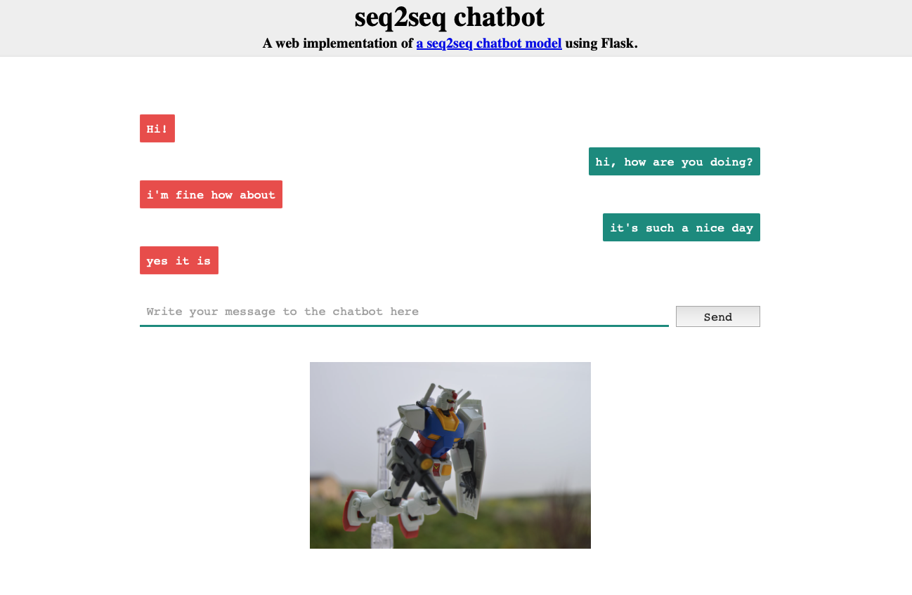

# Seq2Seq Chatbot
### Objective

Build a chatbot using the Seq2Seq model

### Raw data for training
 
conversation.csv (training_model/conversation.csv) from https://www.kaggle.com/datasets/kreeshrajani/3k-conversations-dataset-for-chatbot

### Data cleaning

Removal of ã‚— (UTF8 encoding issue in data)

### Model

TensorFlow with Keras used to build the Seq2Seq model. Both Encoder and Decoder use LSTM layers.

- <h4>Retraining of model (optional)</h4>
  IPython notebook (training_model/Train_seq2seq_model.ipynb) via Google Colab. 
  
  - Select a GPU option (training took 5 minutes using T4 GPU) and upload data to Google Colab (training_model/conversation.csv). 
  - Download the saved model (training_model.h5) and cleaned data (pairs.pkl) for use in app.py to run the chatbot 

- <h4>To run chatbot app</h4>
  Download .py file (app.py). 
  
  - In terminal: ```FLASK_APP=app.py flask run```
  - Open browser to http://127.0.0.1:5000 (port number depends on availability) to load application page 

### Model Tuning

- Loss and Optimisation: categorical cross-entropy loss, RMSprop optimizer
- Validation split: 20% of data used for validation during training 

Testing included:
- Batch size: 50. Tried 10, 150
- Epochs: 1000. Tried 100, 600
- Dimensionalty: 256
- Number of rows of data: 1000. Tried 250, 2000, 3725 (whole data set) 

### Results
<table>
<caption>Inputs vs Outputs</caption>
  <tr>
    <th>Test input</th>
    <th>Reference output</th> 
    <th>Model output</th> 
  </tr>
  <tr>
    <td>"hi, how are you doing?"</td>
    <td>"I'm fine. How about yourself?"</td> 
    <td>"i'm fine how about"</td> 
  </tr>
  <tr>
    <td>"How's it going?"</td>
    <td>"I'm doing well. How about you?"</td> 
    <td>"so you"</td> 
  </tr>
  <tr>
    <td>"I'm doing well. How about you?"</td>
    <td>"Never better, thanks"</td> 
    <td>"how"</td> 
  </tr>
   <tr>
    <td>"So how have you been lately?"</td>
    <td>"I've actually been pretty good. You?"</td> 
    <td>"no heard"</td> 
  </tr>
   <tr>
    <td>"it's such a nice day"</td>
    <td>"Yes, it is"</td> 
    <td>"'yes it is"</td> 
  </tr>
   <tr>
    <td>"where are you going to school?"</td>
    <td>"I'm going to"</td> 
    <td>"i'm going to"</td> 
  </tr>
</table>
<br>

<br>
<table>
<caption>Evaluation Metrics</caption>
  <tr>
    <th>ROUGE-1 (unigram overlap)</th>
    <th>ROUGE-2 (bigram overlap)</th> 
    <th>ROUGE-L (longest common subsequence)</th> 
  </tr>
  <tr>
    <td>'r'(recall): 0.2888</td>
    <td>'r'(recall): 0.1666</td> 
    <td>'r'(recall): 0.2888 </td> 
  </tr>
  <tr>
    <td>'p'(precision): 0.3055 </td>
    <td>'p'(precision): 0.1666</td> 
    <td>'p'(precision): 0.3055</td> 
  </tr>
  <tr>
    <td>'f'(F1 score): 0.2962 </td>
    <td>'f'(F1 score): 0.1666</td> 
    <td>'f'(F1 score): 0.2962 </td> 
  </tr>
  </tr>
</table>
<br>


Screenshot of chatbot app:
<br>
<br>

<br>


### Next steps

- Add more chatbot methods to handle specific user intents and features like error handling
- Experiment with adding more processing power (and the increase in size of input data that could allow)
- Further hyperparameter tuning. Use of grid search or random search
- Early stopping and cross-validation
- Addition of further evaluation metrics eg BLEU, METEOR
- Revisit the underlying model (eg try more advanced architectures like Transformers):
  - Advantages of Seq2Seq:   
    - Seq2seq made a huge step forward when it comes to the generative aspect of chatbots
    - Simple to train as they are (most of the time) purely data-driven
  - Disadvantages of Seq2Seq:   
    - Highly general answers
    - Generated answers are not always well-formed


### References and tools

- https://www.codecademy.com/paths/build-chatbots-with-python
- https://github.com/simra/keras/blob/76e84e9dbcb5e1ff356b1be0ec3499e49772cf8a/examples/lstm_seq2seq.py
- https://github.com/simra/keras/blob/76e84e9dbcb5e1ff356b1be0ec3499e49772cf8a/examples/lstm_seq2seq_restore.py
- https://github.com/chamkank/flask-chatterbot/blob/master/app.py
- https://www.literallyanything.io/iterate 
- https://medium.com/opla/chatbots-approaches-battle-part-1-sequence-to-sequence-vs-reinforcement-learning-731d3db75e0e#:~:text=To%20train%20a%20dialogue%20systemthe%20chatbot%20becomes%20increasingly%20efficient

